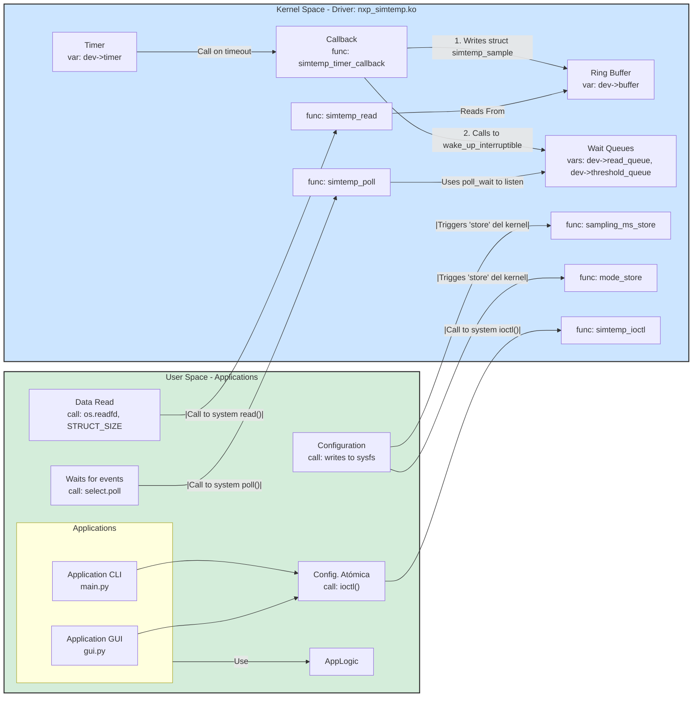

```mermaid
graph LR
    %% Styles for subgraphs
    style KernelSpace fill:#cce5ff,stroke:#333,stroke-width:2px
    style UserSpace fill:#d4edda,stroke:#333,stroke-width:2px
    
    subgraph KernelSpace [Kernel Space - Driver: nxp_simtemp.ko]
        %% Todos los nodos directamente bajo KernelSpace (sin subgrafos anidados)
        T[Timer</br>var: dev->timer]
        CB[Callback</br>func: simtemp_timer_callback]
        RB[Ring Buffer</br>var: dev->buffer]
        WQ[Wait Queues</br>vars: dev->read_queue, dev->threshold_queue]
        
        %% Sysfs Interface nodes
        SYSFS_H1[func: sampling_ms_store]
        SYSFS_H2[func: mode_store]
        
        %% Char Device Interface nodes  
        READ[func: simtemp_read]
        POLL[func: simtemp_poll]
        IOCTL[func: simtemp_ioctl]
        
        %% Kernel internal flow
        T -->|Call on timeout| CB
        CB -->|1. Writes struct simtemp_sample| RB
        CB -->|2. Calls to wake_up_interruptible| WQ
        
        %% Char device internal connections
        READ -->|Reads From| RB
        POLL -->|Uses poll_wait to listen| WQ
    end

    subgraph UserSpace [User Space - Applications]
        subgraph Apps [Applications]
            CLI[Application CLI</br>main.py]
            GUI[Application GUI</br>gui.py]
        end
        
        %% User space logic nodes
        CFG[Configuration</br>call: writes to sysfs]
        RD[Data Read</br>call: os.readfd, STRUCT_SIZE]
        EVT[Waits for events</br>call: select.poll]
        IOCTL_U["Config. Atómica</br>call: ioctl()"]
        
        Apps -->|Use| AppLogic
    end

    %% Space cross flow - Correcciones principales
    
    %% Config through Sysfs - corregido
    CFG -- |Triggers 'store' del kernel| --> SYSFS_H1
    CFG -- |Trigges 'store' del kernel| --> SYSFS_H2
    
    %% Reads data through char device - corregido  
    RD -- |Call to system read()| --> READ
    
    %% Wait for events through poll - corregido
    EVT -- |Call to system poll()| --> POLL
    
    %% IOCTL flow - añadido
    CLI --> IOCTL_U
    GUI --> IOCTL_U
    IOCTL_U -- |Call to system ioctl()| --> IOCTL

```