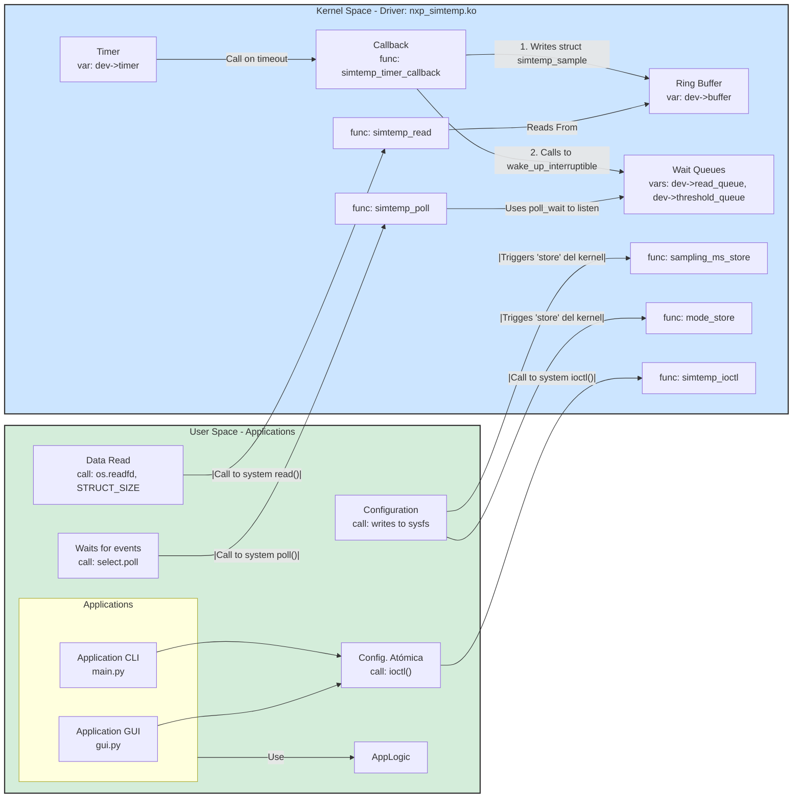

## **1\. Architecture Block Diagram**
This diagram shows the complete data and control flow, from the userspace applications to the kernel driver components.


## **2\. System Interaction (In Words)**
The system is defined to have user space tools (GUI and CLI apps) and kernel space code (such as the kernel itself).
The user space acts as a consumer (gets the data from kernel space).
The kernel space acts as a producer (generates de data).-

* **Producer (Kernel):** A timer (dev-\>timer) fires periodically, calling simtemp\_timer\_callback(). This *producer* generates a struct simtemp\_sample, places it in the dev-\>buffer (a ring buffer), and calls wake\_up\_interruptible() on two wait queues (dev-\>read\_queue and, if the threshold is crossed, dev-\>threshold\_queue).  
* **Consumers (Userspace):**  
  1. **Data Consumer (read):** The Python os.read() call blocks in the kernel's simtemp\_read() function. This function sleeps on the dev-\>read\_queue until the producer wakes it up, at which point it reads from the ring buffer and copies the data to user space.  
  2. **Event Consumer (poll):** The Python select.poll() call blocks in the kernel's simtemp\_poll() function. This function simultaneously listens to *both* wait queues. It returns POLLIN if dev-\>read\_queue is woken (new data) or POLLPRI if dev-\>threshold\_queue is woken (alert).  
* **Control (Userspace):** The user can change driver parameters (like sampling\_ms) by writing to sysfs files, which triggers the corresponding \_store functions in the kernel.

## **3\. Design Decisions (Problem-Solving Write-up)**

### **Locking Choices: spin\_lock\_bh vs. spin\_lock vs mutex**

This driver requires careful locking to protect the dev-\>buffer (ring buffer) from simultaneous access by two different execution contexts:

1. **Process Context:** The user's application calling read(), poll(), ioctl(), or sysfs\_store().  
2. **Softirq Context:** The kernel's timer\_callback function (simtemp\_timer\_callback) firing to produce data.

An initial design was developed considering a mutex, but this was **incorrect** and lead to kernel bugs.

1. **mutex (Incorrect)**  
   * **Why it failed:** A mutex is a **sleeping lock**. It can *only* be used by code running in **process context** (like our simtemp\_read function). Our timer\_callback runs in **softirq context** (an atomic context that cannot sleep).  
   * **The Problem:** If simtemp\_timer\_callback (softirq) tried to acquire a mutex, it would call a sleeping function from an atomic context, which is illegal and causes a kernel panic or deadlock. Therefore, mutex is not a valid option for synchronizing between process context and softirq/interrupt context.  
   This was a part of the actual log:  
   ```
    [12357.306390] watchdog: BUG: soft lockup - CPU#3 stuck for 1908s! [swapper/3:0]
    [12357.306410] Modules linked in: nxp_simtemp(OE) snd_seq_dummy ...
    [12357.306647] CPU: 3 UID: 0 PID: 0 Comm: swapper/3 Tainted: G        OE    6.14.0-33-generic
    [12357.306658] Hardware name: innotek GmbH VirtualBox/VirtualBox, BIOS VirtualBox 12/01/2006
    [12357.306663] RIP: 0010:pv_native_safe_halt+0xb/0x10
    ```
2. **spin\_lock\_bh(\&dev-\>lock) (Correct for Process Context)**  
   * **Where:** Used in all file\_operations (read, poll, ioctl) and sysfs\_store functions.  
   * **Why:** This is the correct solution. When called from process context, spin\_lock\_bh does two things: it acquires the spinlock *and* it disables softirqs on the local CPU. This **prevents the timer\_callback (softirq) from interrupting** the read function while it's in the middle of accessing the ring buffer, thus preventing a race condition.  
3. **spin\_lock(\&dev-\>lock) (Correct for Softirq Context)**  
   * **Where:** Used *only* inside the simtemp\_timer\_callback function.  
   * **Why:** The timer callback is *already* in a softirq context. It cannot be interrupted by another softirq (like itself). We only need to protect against other CPUs or a Hard IRQ. A simple spin\_lock (which also disables local hard IRQs) is the correct, standard mechanism to use *inside* the softirq handler.  

### **API Trade-offs: sysfs vs. ioctl**

This project uses **both** sysfs and ioctl to demonstrate the tradeoffs.

* **sysfs (Used for most control):**  
  * **Pros:** The modern, standard way to configure drivers. It's "filesystem-based," human-readable, and requires no special C headers for a user to write a simple shell script (echo 100 \> sampling\_ms). It's perfect for simple, "one-at-a-time" parameter tuning.  
  * **Cons:** **Not atomic.** Changing the mode and the threshold requires two separate write() calls. A race condition could occur where the timer fires *between* these two calls, running with a "mixed" configuration (e.g., "ramp" mode but the *old* threshold).  
  * **Our Use:** Used for all non-critical, human-tunable parameters (sampling\_ms, mode, threshold\_mC) and for reading stats.  
* **ioctl (Used for atomic control):**  
  * **Pros:** **Atomic.** Our SIMTEMP\_IOC\_SET\_CONFIG ioctl accepts a single struct containing *all* parameters (sampling\_ms and threshold\_mC). The driver receives this struct and applies both values inside a single spin\_lock region. This guarantees the driver never runs with a "mixed" state.  
  * **Cons:** Requires a custom C header file (nxp\_simtemp\_ioctl.h) to be shared with the user application. It's a binary, non-human-readable API that can't be used from a shell.  
  * **Our Use:** Provided as a demonstration of a more robust, atomic API for configuration.

### **Device Tree (DT) Mapping (TEST \= 0\)**

The driver is built as a dual-mode module. When compiled for production (\#define TEST 0):

1. **Binding (.of\_match\_table):** The platform\_driver structure sets .of\_match\_table \= simtemp\_of\_match. This tells the kernel to call our simtemp\_probe function *only* if it finds a device in the DT with compatible \= "nxp,simtemp".  
2. **Property Parsing (probe):**  
   * Inside simtemp\_probe, we check if dev-\>of\_node is valid.  
   * We use of\_property\_read\_u32(dev-\>of\_node, "sampling-ms", \&val) to read the sampling-ms \= \<...\> value from the .dtsi file.  
   * We use of\_property\_read\_u32(dev-\>of\_node, "threshold-mC", \&val) to read the threshold-mC \= \<...\> value.  
3. **Defaults (Fallback):** If of\_property\_read\_u32 fails (returns non-zero), it means the property was missing from the DT. In this case, the driver falls back to hard-coded defaults (e.g., interval\_ms \= 1000). This makes the driver robust.

### **Scaling: What breaks at 10 kHz sampling?**

A 10 kHz sampling rate means sampling\_ms \= 0.1 (or 100us). This is extremely fast and will stress several parts of the system.

1. **timer\_list (The first bottleneck):** Standard kernel timers (timer\_list) are not designed for such high-frequency, high-precision work. They are "soft" timers that can drift. We would need to switch to hrtimer (High Resolution Timer) for this.  
2. **Lock Contention (spin\_lock):** At 10 kHz, the timer\_callback (Producer) will fire every 100µs. Any read() or sysfs write (Consumer) that holds the spin\_lock\_bh for more than 100µs will cause the timer to be delayed, leading to massive data loss and instability. pr\_info calls inside the lock (like our alert message) are especially slow and would need to be removed or replaced with tracepoints.  
3. **Ring Buffer Overrun:** The buffer size (SIMTEMP\_BUFFER\_SIZE \= 16\) is tiny. At 10 kHz, it will be full in **1.6ms**. If the user-space read() call (which involves context-switching, scheduling, etc.) can't run at least every 1.6ms, we will lose data. We would need to significantly increase this buffer size (e.g., to 1024 or more).